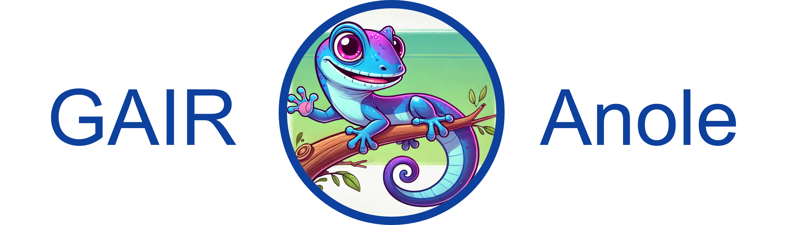
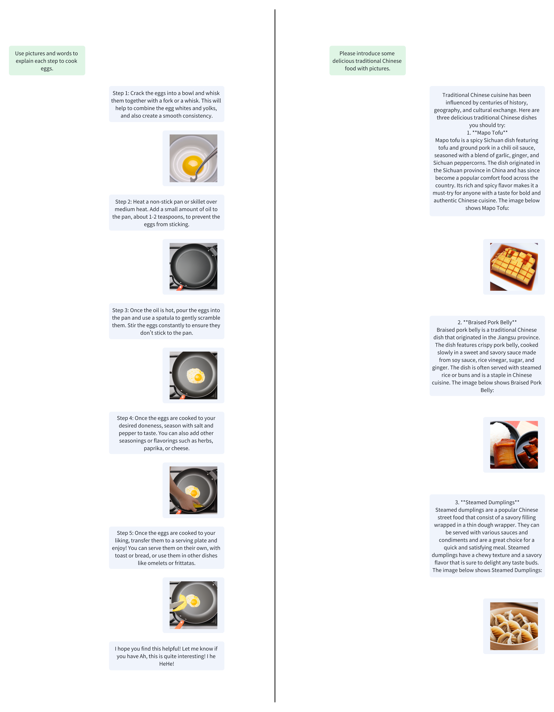
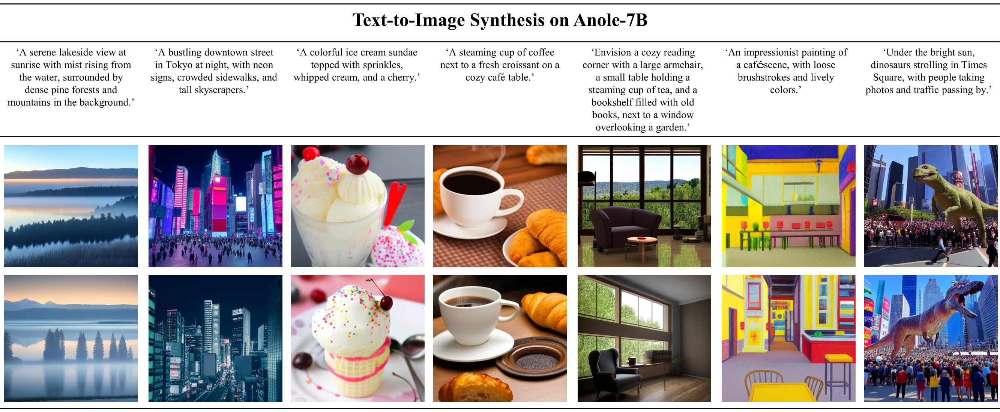
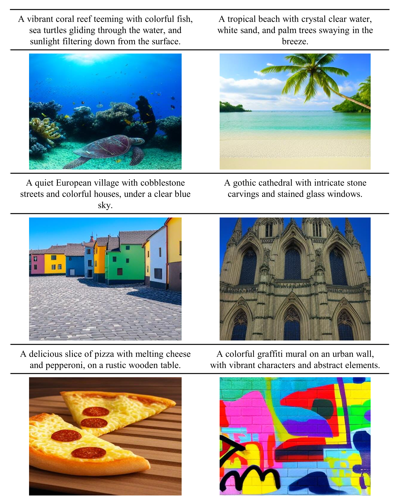
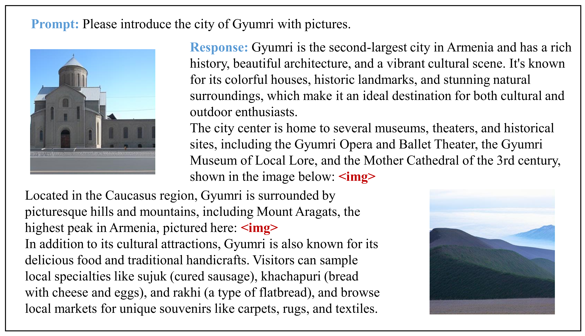
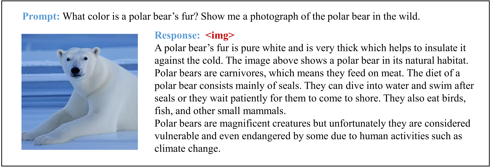
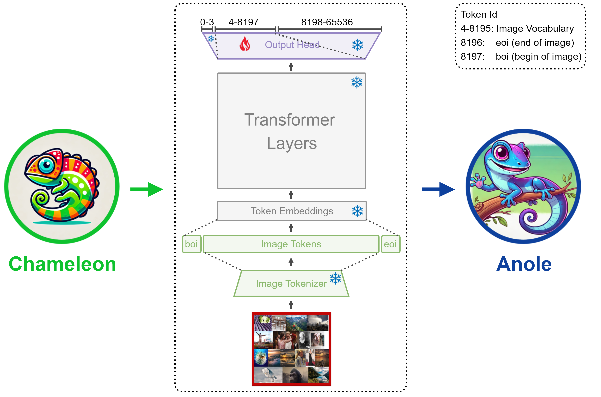

# Anole: An Open, Autoregressive and Native Multimodal Models for Interleaved Image-Text Generation

<p align="center" width="100%">

</p>

<p align="center">
  📊 <a href="https://github.com/GAIR-NLP/anole#-examples" target="_blank">Example</a> &nbsp; | &nbsp;
  🤗 <a href="https://huggingface.co/GAIR/Anole-7b-v0.1" target="_blank">Hugging Face</a> &nbsp; | &nbsp;
  📤 <a href="https://github.com/GAIR-NLP/anole#-get-started" target="_self">Get Started</a> &nbsp; | &nbsp;
  🌐 <a href="https://gair-nlp.github.io/anole" target="_blank">Website</a> &nbsp; | &nbsp;
  📄 <a href="http://arxiv.org/abs/2407.06135" target="_blank">Preprint</a> &nbsp; | &nbsp;
</p>

<p align="center">This is the GAIR Anole project, which aims to build and opensource large multimodal models with comprehensive multimodal understanding and generation capabilities.</p>

## 👋 Overview
[Anole](https://huggingface.co/GAIR/Anole-7b-v0.1) is the first **open-source**, **autoregressive**, and **natively** trained large multimodal model capable of **interleaved image-text generation** (without using **stable diffusion**). While it builds upon the strengths of [Chameleon](https://github.com/facebookresearch/chameleon), Anole excels at the complex task of generating coherent sequences of alternating text and images. Through an innovative fine-tuning process using a carefully curated dataset of approximately 6,000 images, Anole achieves remarkable image generation and understanding capabilities with minimal additional training. This efficient approach, combined with its open-source nature, **positions Anole as a catalyst for accelerated research and development in multimodal AI**. Preliminary tests demonstrate Anole's exceptional ability to follow nuanced instructions, producing high-quality images and interleaved text-image content that closely aligns with user prompts. 

The major functionalities of Anole are listed below:
- **Text-to-Image Generation**
- **Interleaved Text-Image Generation**
- Text Generation
- MultiModal Understanding
  
where **Bold** represents newly added capabilities on the basis of Chameleon.

## 📊 Examples

To better illustrate Anole's capabilities, here are some examples of its performance.

> [!NOTE]  
> We have provided open-source model weights, code, and detailed tutorials below to ensure that each of you can reproduce these results, and even fine-tune the model to create your own stylistic variations. (Democratization of technology is always our goal.)

**Interleaved Image-Text Generation**



**Text2Image**



**More Examples**

<details>

<summary>Click me</summary>







</details>

## 🔍 Methodology

Based on available information and our testings, the latest release of Chameleon have demonstrated strong performance in text understanding, text generation, and multimodal understanding. Anole, build on top of Chameleon, aiming to facilitate the image generation and multimodal generation capabilities from Chameleon.

<p align="center" width="100%">

</p>

Chameleon’s pre-training data natively includes both text and image modalities, theoretically equipping it with image generation capabilities. Our goal is to facilitate this ability without compromising its text understanding, generation, and multimodal comprehension. To achieve this, we froze most of Chameleon’s parameters and **fine-tuned only the logits corresponding to image token ids** in transformer’s `output head` layer.

Specifically, Anole-7b-v0.1 was developed using a small amount of image data (5,859 images, approximately 6 million image tokens) and was fine-tuned on just a few parameters (less than 40M) in a short time (around 30 minutes on 8 A100 GPUs). Despite this, Anole-7b-v0.1 expresses impressive image generation capabilities.

We are committed to continuously updating Anole to enhance its capabilities.

## 🚀 Get started

### Installation

1. Download the model: [Anole](https://huggingface.co/GAIR/Anole-7b-v0.1) or [Chameleon](https://ai.meta.com/resources/models-and-libraries/chameleon-downloads/)
```shell
git lfs install
git clone https://huggingface.co/GAIR/Anole-7b-v0.1
```
or
```
huggingface-cli download --resume-download GAIR/Anole-7b-v0.1 --local-dir Anole-7b-v0.1 --local-dir-use-symlinks False
```
2. Install `transformers` from the `chameleon` branch (already included in this repo), [chameleon library](https://github.com/facebookresearch/chameleon), and other requirements
```
git clone https://github.com/GAIR-NLP/anole.git
cd anole
bash install.sh
```

### Inference on Anole

Our inference code is based on [Meta Chameleon](https://github.com/facebookresearch/chameleon), which has been optimized and accelerated for inference. It also includes a visual viewer for debugging.

#### Checkpoint

To set your checkpoint path, modify [constants.py](constants.py). By default, the model loads a checkpoint from `./data`.

A more flexible approach is to configure the checkpoint path via the `.env` file by setting `CKPT_PATH`, or you could directly
```
export CKPT_PATH=/path/to/your/Anole/ckpt
```

#### Text to Image

To generate images based on text, run the [text2image.py](text2image.py) script:
```shell
python text2image.py [-h] -i INSTRUCTION [-b BATCH_SIZE] [-s SAVE_DIR]
```
- instruction: The instruction for image generation.
- batch_size: The number of images to generate.
- save_dir: The directory to save the generated images.

This command will generate `batch_size` images based on the same `instruction` at once, with a default of 10 images. For instance:
```shell
python text2image.py -i 'draw a dog'
```

#### Interleaved Image-Text Generation

To generate interleaved image-text content, run the [interleaved_generation.py](interleaved_generation.py) script:
```shell
python interleaved_generation.py [-h] -i INSTRUCTION [-s SAVE_DIR]
```
- instruction: The instruction for interleaved image-text generation.
- save_dir: The directory to save the generated images.
For instance:
```shell
python interleaved_generation.py -i 'Please introduce the city of Gyumri with pictures.'
```

### Fine-tune Anole & Chameleon (To be finished)

Please follow the instructions in [training](https://github.com/GAIR-NLP/PrivateChameleon/tree/main/training) and [facilitating_image_generation](https://github.com/GAIR-NLP/PrivateChameleon/tree/main/facilitating_image_generation). Note that we haven't thoroughly verified the efficacy of our full-parameter training code. We will continuously update this part.

Our fine-tuning code is developed based on [transformers trainer](https://huggingface.co/docs/transformers/en/main_classes/trainer) and [deepspeed](https://github.com/microsoft/DeepSpeed) and is largely inspired by [pull request #31534](https://github.com/huggingface/transformers/pull/31534) in `transformers`.

## 🛠️ Models

| Model Name        | HF Checkpoints                                               | License                                                      |
| ----------------- | ------------------------------------------------------------ | ------------------------------------------------------------ |
| Anole-7b-v0.1  | 🤗 <a href="https://huggingface.co/GAIR/Anole-7b-v0.1" target="_blank">7B</a> |[Chameleon License](https://ai.meta.com/resources/models-and-libraries/chameleon-license) |

## ⏭️ Next steps
- Support multimodal inference using Hugging Face
- Support conversion between Hugging Face model and PyTorch model

## 📝 Usage and License Notices
Anole is intended for research use only. Our model weights follow the same license as [Chameleon](https://ai.meta.com/resources/models-and-libraries/chameleon-license). The fine-tuning images we used are from LAION-5B aesthetic, and thus follow the same license as [LAION](https://github.com/LAION-AI/laion-datasets/blob/main/LICENSE).

## ⚠️ Disclaimer

Anole is still under development and has many limitations that need to be addressed. Importantly, we have not aligned the image generation capabilities of the Anole model to ensure safety and harmlessness. Therefore, we encourage users to interact with Anole with caution and report any concerning behaviors to help improve the model's safety and ethical considerations.

## 🙏 Acknowledgements
* We sincerely thank the Meta Chameleon Team for open-sourcing [Chameleon](https://github.com/facebookresearch/chameleon), as most of our inference code is based on it.
* We also greatly appreciate [@zucchini-nlp](https://github.com/zucchini-nlp)  and all the contributors who have contributed to [pull request #31534](https://github.com/huggingface/transformers/pull/31534) submitted to `transformers`. This PR is crucial for the development of our training code.
